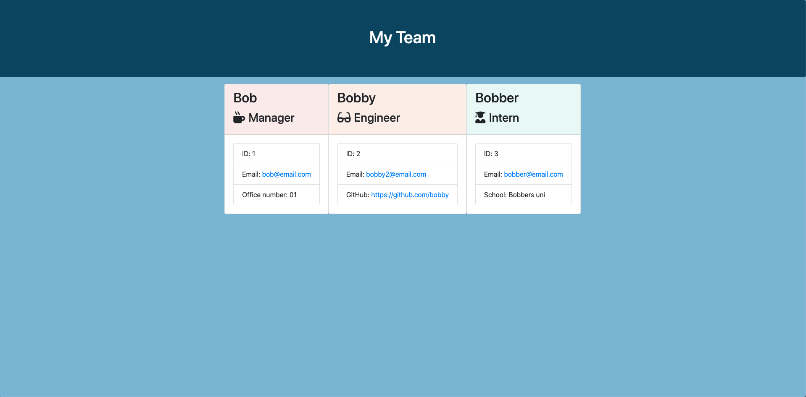

# Team-Profile-Generator

## Table of Contents
* [Introduction](#introduction) 
* [How it Works](#how-it-works)
* [Requirements](#requirements)
* [Demo Images](#demo-images)
* [Contact](#contact)
* [Links](#links)

## Introduction
Creates profiles that has information depending on the profile.

## How it Works
Using the CLI you'll have the following option to choose between a Manager, Intern or an Engineer.
After choosing one you'll fill out information to display on its profile. You can can generate as many as you like by choosing 'Yes' when asked.
Whenever choosing 'No' a 'team.html' file will be created insde the output folder. Running the team.html will show you all the profiles chosen.

## Demo Images
**Terminal Example**

**Information From Terminal**

## Contact
If you want to contact me you can reach me at 5205bda@gmail.com

## Links

[Github](https://github.com/banda-adrian)
